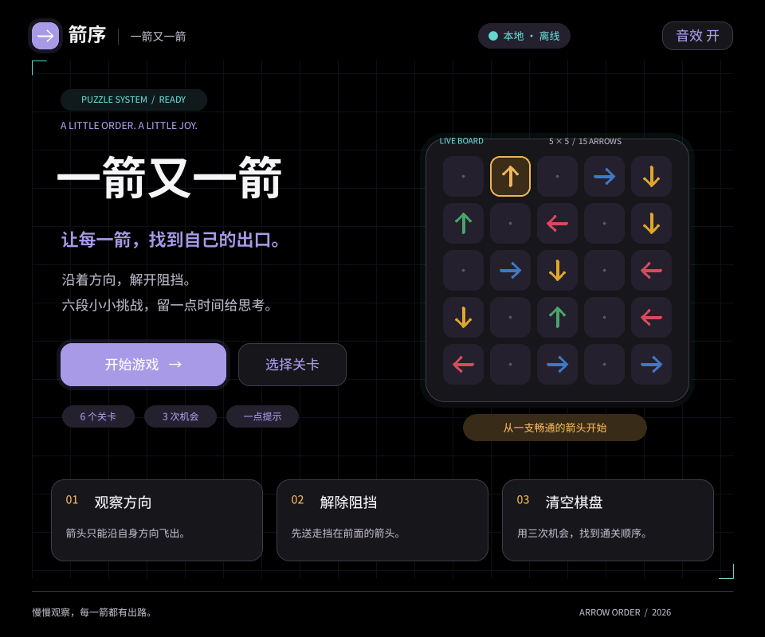
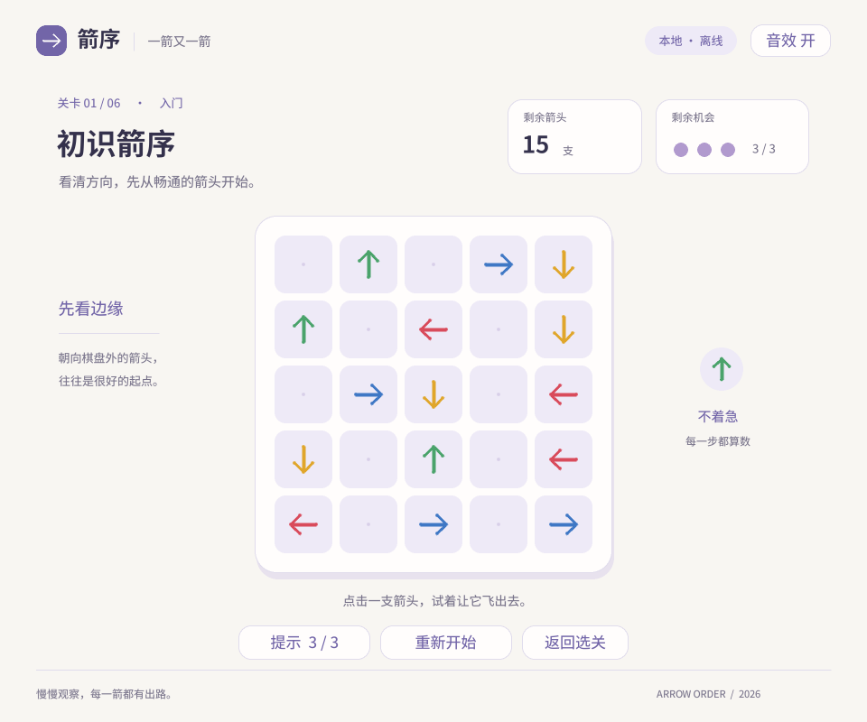

# 一箭又一箭 · 箭序

使用 Python 与 pygame-ce 开发的单格箭头解谜游戏，课程项目。

**当前进度：阶段 2，完整可玩版已实现，正在进行最终试玩与材料整理。**

已准备六个可解关卡、路径规则、碰撞和飞出动画、提示、选关解锁、最佳成绩、存档和轻量音效。每关仍需要用户本人实际试玩并记录反馈；自动化验证不替代本人试玩。

## Windows 预览程序

完整可玩程序为 `dist/ArrowOrder.exe`；阶段 1 的静态界面预览仍在 `dist/ArrowOrder-Preview-Windows.zip`。完整程序无需安装 Python，也不需要联网，首次启动后会在用户 APPDATA 下保存进度。领取 EXE 时，请同时保留旁边的 `OFL.txt` 字体许可。

完整程序中左键点击箭头，`R` 或按钮重开，提示按钮显示剩余提示，结果页提供下一关和选关；`Esc` 退出。静态预览仍按 `1`—`8` 切换画面，完整说明见 [预览程序交付说明](docs/PREVIEW_DELIVERY.md)。

## 看预览

直接打开 [交互预览画廊](docs/previews/index.html)，切换首页、选关、游戏、提示、碰撞、通关、失败和最终完成画面。浏览器画廊不需要 Python。





## 运行 Pygame 预览

开发环境：Windows、CPython 3.13.5、pygame-ce 2.5.8。字体随项目提供，不依赖系统字体，不需要联网运行。

```powershell
python -m venv .venv
.\.venv\Scripts\python.exe -m pip install -r requirements.txt
.\.venv\Scripts\python.exe preview.py
```

运行完整游戏：

```powershell
.\.venv\Scripts\python.exe game.py
```

预览窗口支持缩放。按 `1`—`8` 切换画面，`Esc` 退出；部分导航按钮可以切换预览画面。棋盘不执行消除逻辑，声音按钮也只是外观预览。

导出截图（无可见窗口）：

```powershell
.\.venv\Scripts\python.exe preview.py --export
```

资源路径基于脚本文件定位，因此也可从其他目录通过 `preview.py` 的绝对路径启动。

## 设计与记录

- [需求与验收标准](docs/PRD.md)
- [开发记录、PSP 与本人试玩记录](docs/DEVELOPMENT.md)
- [来源与字体许可说明](docs/REFERENCES.md)
- [阶段 1 检查记录](docs/PREVIEW_REVIEW.md)

## 字体

`assets/fonts/ArrowOrder-Regular.ttf` 与 `ArrowOrder-Semibold.ttf` 是 Noto Sans SC 的常规/半粗静态字重子集，包含 GB2312 字符集和界面符号，已改名为 ArrowOrder Sans。完整字体许可见 [SIL OFL 1.1](assets/fonts/OFL.txt)。

运行不需要重新生成字体。仅开发者重建资源时，运行 `tools/fetch_font.py` 下载 Google Fonts 官方源字体，然后在安装了 `fonttools` 的环境执行 `tools/prepare_font.py`。字体生成工具不属于游戏运行依赖。

## 项目范围

完整版本含 6 个递进关卡、每关 3 次失误机会与 3 次提示、选关解锁、最佳成绩保存和可静音音效。每关需用户本人实际试玩；自动化检查不能代替本人试玩。GitHub 仓库：<https://github.com/ddxww/arrow-order>；学号待最终材料阶段补齐。

## 重建 Windows 预览包

在 Windows 开发环境运行：

```powershell
.\.venv\Scripts\python.exe -m pip install -r requirements-build.txt
.\tools\build_preview.ps1
```

生成 `dist/ArrowOrder-Preview.exe` 与包含说明和字体许可的ZIP。已对EXE进行无窗口运行检查：8张截图全部导出，结果与源码渲染完全一致。此项为打包验证，非本人试玩。

完整游戏打包：`.\tools\build_game.ps1`（生成 `dist/ArrowOrder.exe`）。
