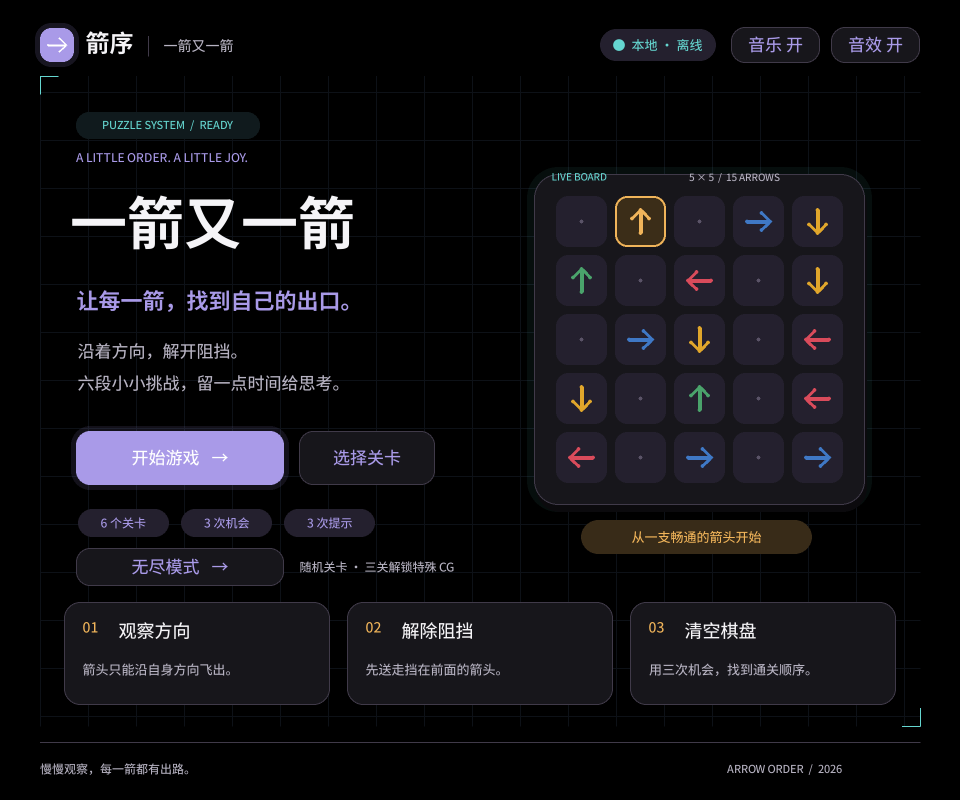
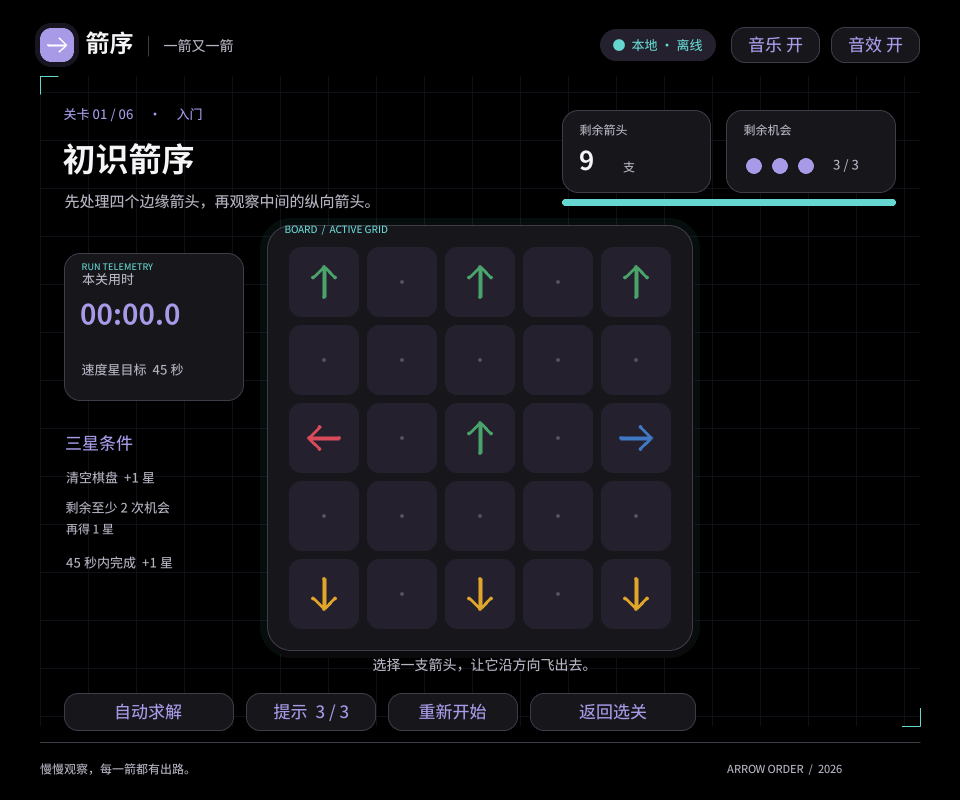
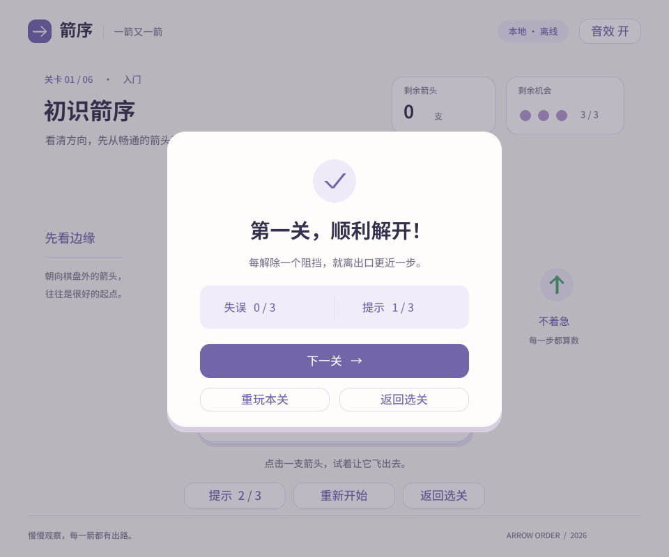
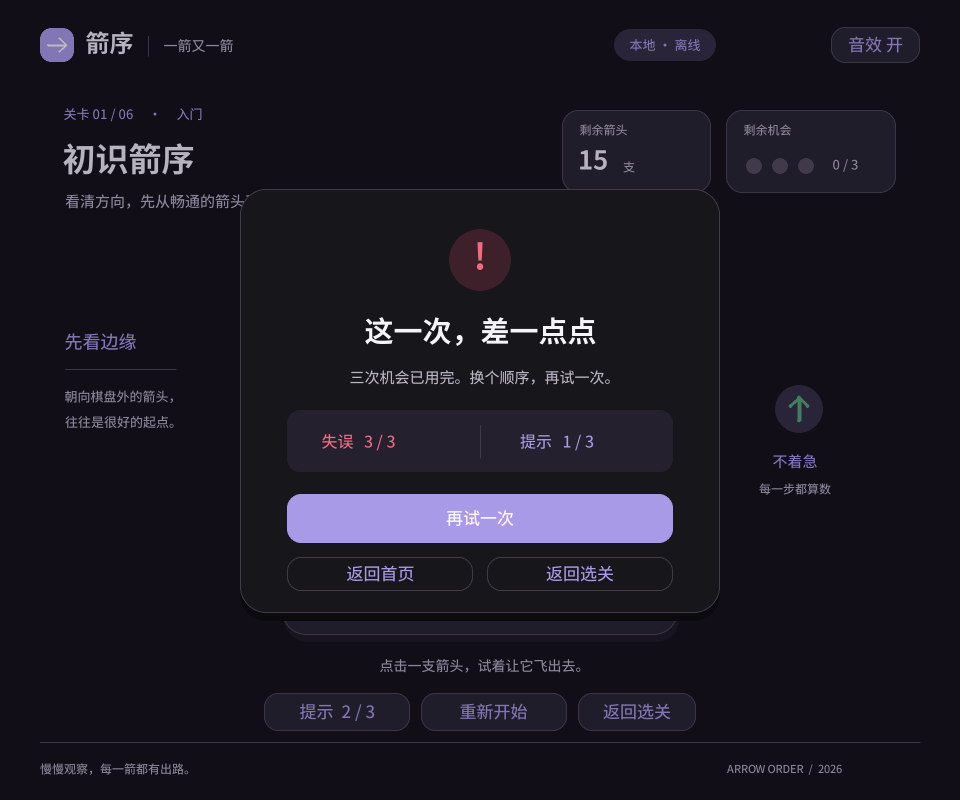
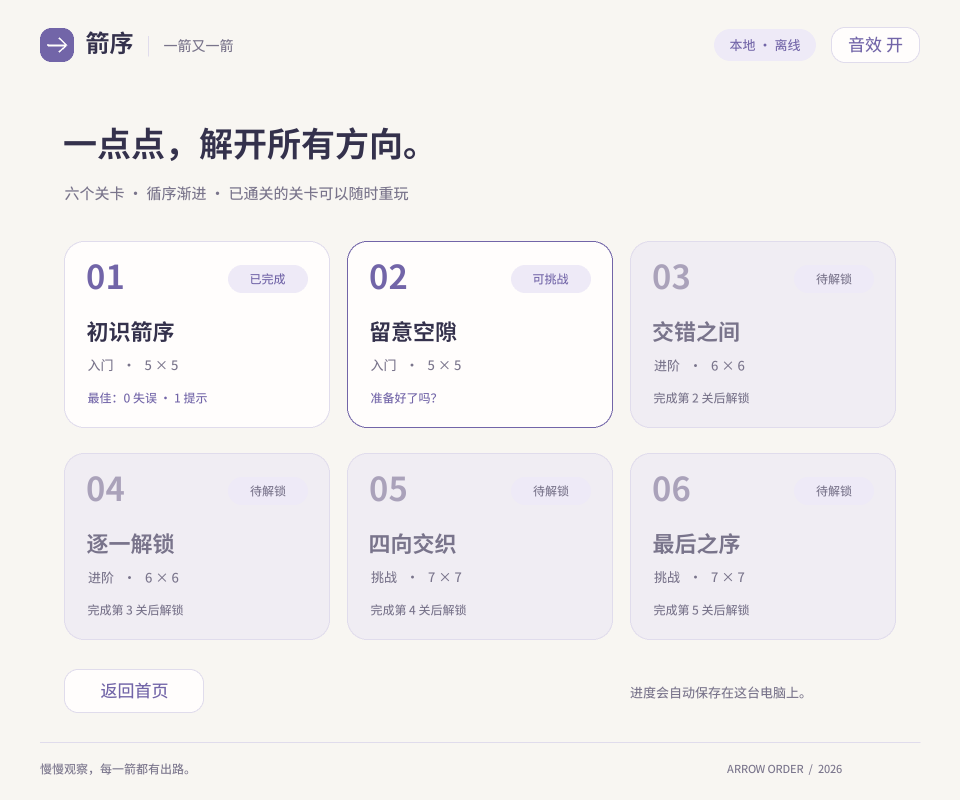
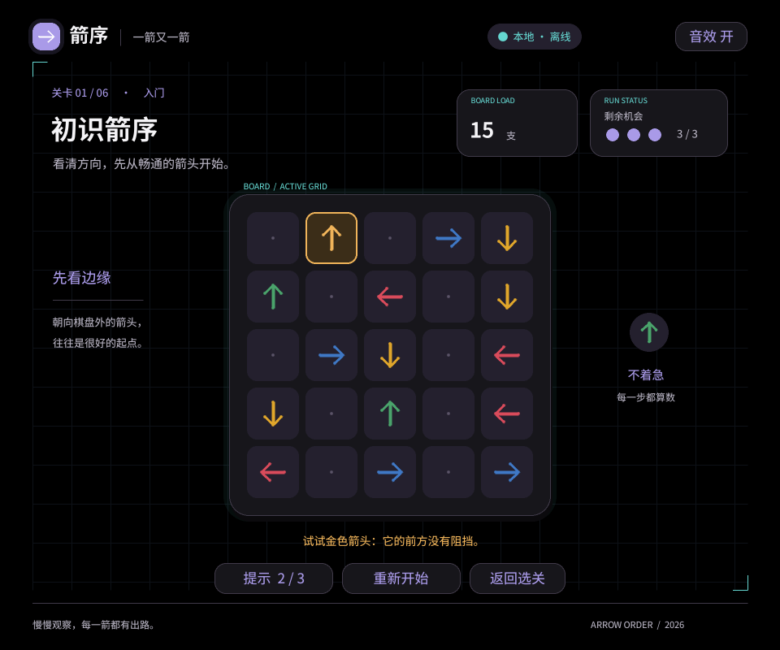
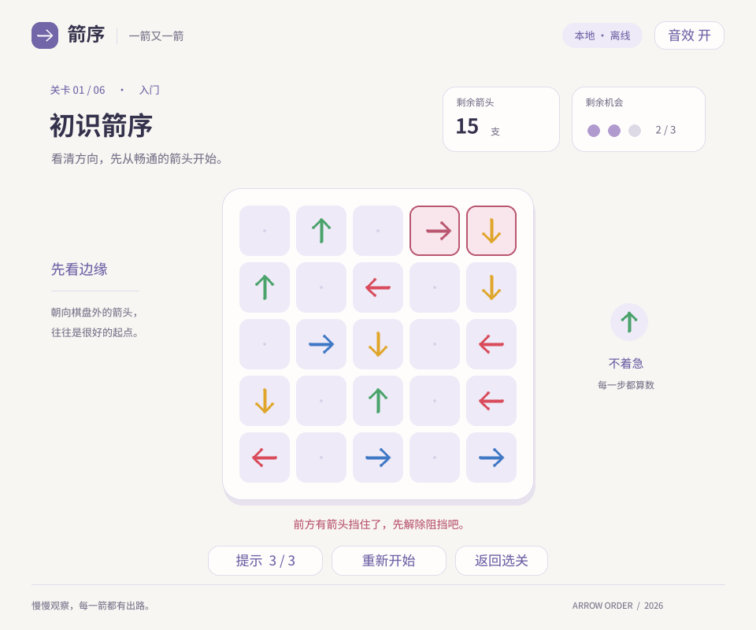

# 一箭又一箭 · 箭序

一款使用 Python 和 pygame-ce 开发的单格箭头解谜游戏。玩家需要按箭头方向依次点击棋盘上的箭头，在有限机会内完成每一关。

## 当前版本

- 6 个递进的普通关卡，支持选关解锁、提示、自动求解、重开和最佳成绩保存。
- 每关最多 3 颗星：成功通关、剩余至少 2 次机会、在目标时间内完成分别获得 1 星。
- 柔和的原创循环背景音乐《安静的午后》、操作音效和胜利音效，音乐与音效可以分别静音。
- 失败提示、最后一次机会提示、红色残血视野边缘和渐入渐出的表情图片动画。
- 四种方向使用不同颜色：左红、下黄、右蓝、上绿，便于快速识别箭头方向。
- 无尽模式：随机生成可解棋盘，难度参考普通关卡 1～6，不评价星级。
- 无尽模式累计通关 3 次后显示特殊 CG，包括用户提供的图片、GIF 和活动文案。
- 首页右侧提供放大的 GitHub 图标按钮，点击后打开项目主页：<https://github.com/ddxww/arrow-order>。
- 黑色高级 HUD 界面：细网格背景、实时状态芯片、棋盘负载进度条、任务选择难度刻度和通关报告层。
- 成就系统：奖杯入口显示“👍”“完美通关”“我爱arrow”三项成就，并保存普通全通、全三星和无尽累计三关的进度。

## Windows 运行

完整游戏可直接运行 `dist/ArrowOrder.exe`，不需要安装 Python 或联网。v1.0.1 使用独立的 `progress_v1.json` 存档名，首次启动不会继承旧预览版的成就或关卡记录；之后的进度会在用户的 APPDATA 目录保存。发布 EXE 时请同时保留字体许可文件 `assets/fonts/OFL.txt`。

在开发环境运行：

```powershell
python -m venv .venv
.\.venv\Scripts\python.exe -m pip install -r requirements.txt
.\.venv\Scripts\python.exe game.py
```

操作说明：左键点击箭头；鼠标移到按钮、选关卡片或成就入口时会显示高亮边框，表示当前选项可以操作。点击“自动求解”会按当前关卡的合法顺序逐步清空棋盘，按钮随后变为“停止自动求解”，再次点击会在当前箭头完成后恢复手动操作；提示高亮状态下也可以直接启动；飞出反馈约 0.18 秒、碰撞反馈约 0.14 秒，方便连续操作；按 `R` 或点击重开按钮重新开始；提示按钮显示剩余提示；`Esc` 退出。自动求解期间棋盘点击会被忽略，但可以停止、重开或返回。通关后可以进入下一关或打开选关页面。

## 无尽模式

无尽模式的棋盘大小为 5×5 至 7×7，箭头数量和阻挡层数参考普通关卡的难度范围。游戏页的“保存本局”会保存当前棋盘、轮次、剩余机会、提示次数和用时；返回首页或关闭窗口时也会自动保存。首页出现“继续无尽”后可以恢复上次进度，也可以选择“新开无尽”放弃旧局重新开始。每局重新开始时恢复 3 次机会和 3 次提示，只记录本轮用时与通关次数，不影响普通关卡存档。

累计通关 3 次会解锁一次特殊 CG。CG 页面会显示用户提供的微信图片、循环 GIF，以及文案“加作者凭借这个通过图片可以获得0.01元🧧”。点击“继续挑战”可以生成下一张随机棋盘；失败后可以重试当前棋盘。

## 音乐与紧张效果

普通关卡使用离线合成的 72 BPM 柔和循环音乐，音频文件位于 `assets/audio/quiet_afternoon.wav`。当只剩 1 次机会时，音乐会降低音量并叠加双拍心跳，同时显示红色视野边缘；心跳和红边会平滑渐入，并在紧张状态结束后淡出。失败和最后一次机会图片也会渐入、停留约 1 秒后渐出，避免突然出现。

## 预览与测试

浏览器交互预览位于 [docs/previews/index.html](docs/previews/index.html)，不需要 Python。运行预览程序：

```powershell
.\.venv\Scripts\python.exe preview.py
```

运行自动化测试：

```powershell
python -m unittest tests.test_endless tests.test_game tests.test_scoring
```

## 演示视频与界面图片

完整玩法演示：[哔哩哔哩视频](https://www.bilibili.com/video/BV1mGep6AE5i/)。

下面是游戏的主要界面截图：
















## 项目目录

- `game.py`：完整游戏入口。
- `arrowgame/`：关卡、评分、特效、无尽模式和特殊 CG 逻辑。
- `assets/`：字体、图片、GIF、音乐和音效资源。
- `tests/`：游戏逻辑、评分和无尽模式测试。
- `tools/`：音乐、CG 素材和 Windows 打包工具。
- `docs/`：需求、开发记录、来源说明和预览材料。

## 重建资源和打包

安装构建依赖后，可使用以下命令重建 Windows 程序：

```powershell
.\.venv\Scripts\python.exe -m pip install -r requirements-build.txt
.\tools\build_game.ps1
```

音乐由 `tools/compose_music.py` 离线合成，GIF 素材可使用 `tools/prepare_cg.py` 重建；运行游戏不需要 Pillow 或联网。

## 字体与来源

项目自带 `ArrowOrder-Regular.ttf` 和 `ArrowOrder-Semibold.ttf`，字体许可见 [SIL OFL 1.1](assets/fonts/OFL.txt)。其他素材来源和许可记录见 [docs/REFERENCES.md](docs/REFERENCES.md)。
