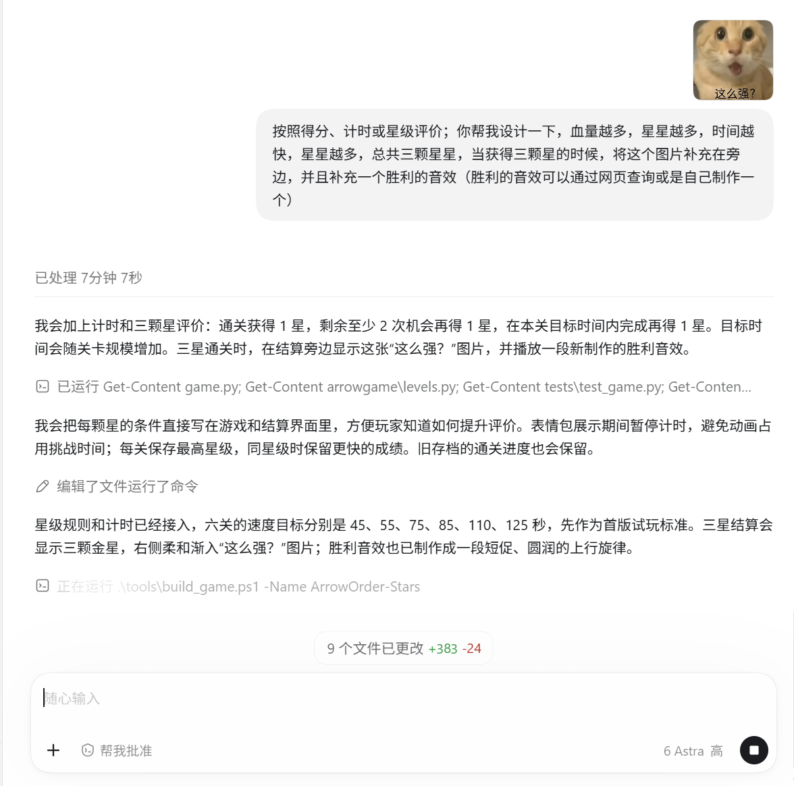
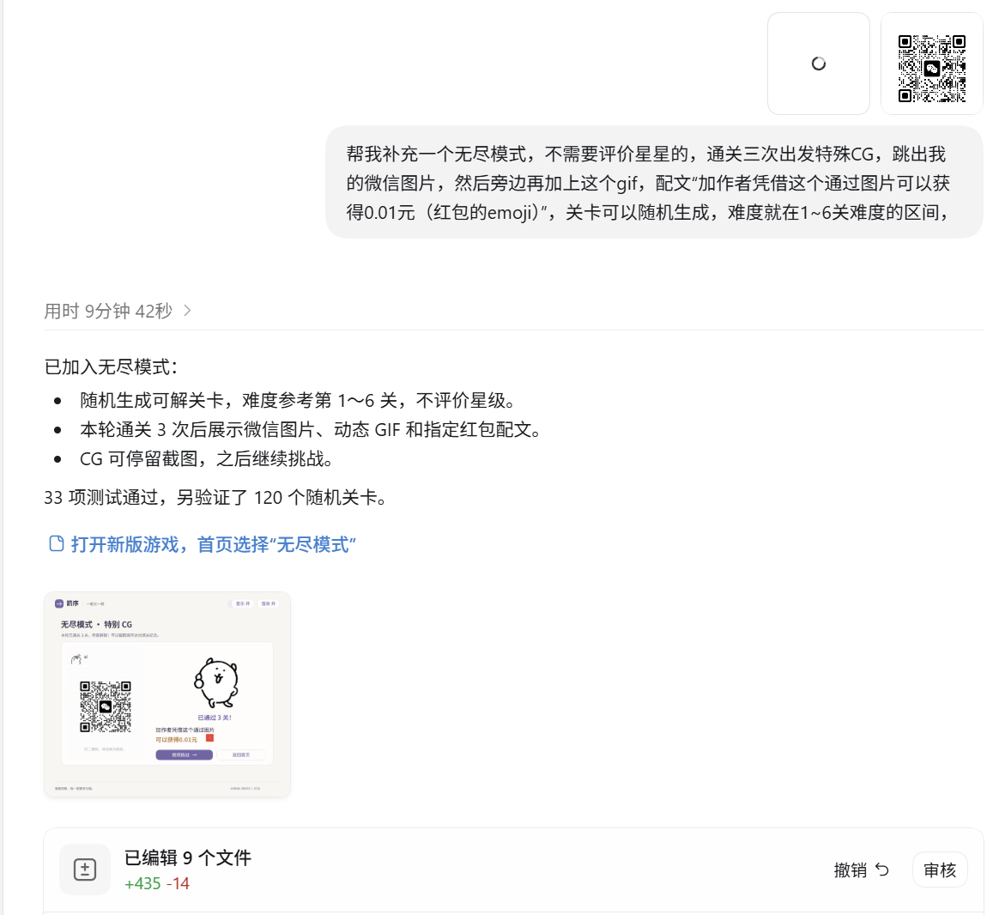
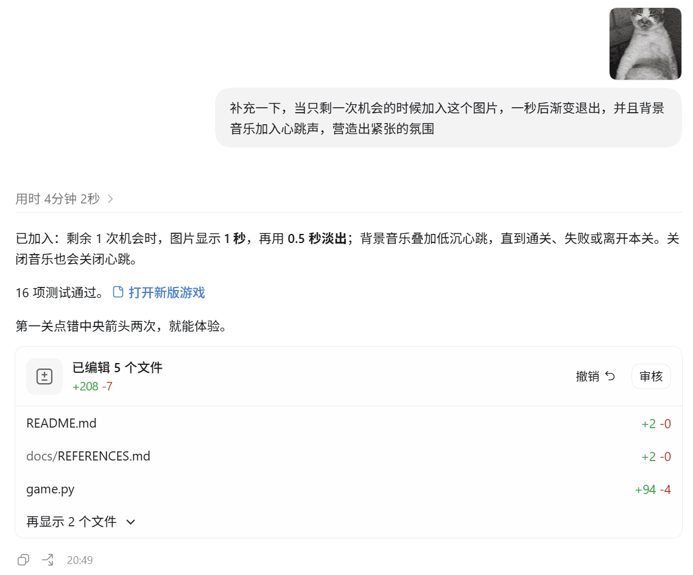

# AIGC 使用过程记录

本项目使用 Codex 辅助完成需求拆解、代码实现、测试和文档整理。下面记录 3 次具有代表性的使用过程。每次记录都包含我提出的要求、AI 完成的内容、实际效果，以及我根据试玩和检查结果做的修改。

## 过程一：加入星级评价和胜利反馈

### 我提出的要求

我希望游戏可以按照得分、计时或星级评价玩家表现：血量（剩余机会）越多、完成时间越快，获得的星星越多，总共三颗星；获得三颗星时，在结算页面显示我提供的图片，并播放胜利音效。胜利音效可以查询免费素材，也可以由程序制作。

### AI 完成的内容

AI 设计了三项独立的得星条件：成功通关获得一颗星，剩余至少两次机会再获得一颗星，在目标时间内完成再获得一颗星。随后增加了计时器、星级计算、最佳成绩保存、三星结算图片和一段离线合成的胜利旋律。

### 实际效果

普通关卡能够在结算页显示本次用时、剩余机会和星级。三星时，用户提供的图片会出现在结算信息旁边；通关时会播放胜利音效，音效开关关闭后不会播放。截图中可以看到，这个需求从文字规则变成了可见的结算反馈。

### 我的修改

我检查后要求把星级条件直接写入游戏和结算界面，避免玩家不知道怎样获得三星；同时要求胜利图片平滑渐入，并把音效调整为更柔和的短旋律。AI 原先的默认测试环境还出现过音频设备和临时目录权限问题，我区分环境报错与代码断言后重新验证了游戏逻辑。

## 过程二：加入无尽模式和特殊 CG

### 我提出的要求

我要求补充一个无尽模式：不评价星星，关卡随机生成，难度保持在普通模式第 1～6 关的区间；累计通关三次后触发特殊 CG，显示我的微信图片、GIF 和文案“加作者凭借这个通过图片可以获得0.01元🧧”，并允许继续挑战。

### AI 完成的内容

AI 新增了无尽模式状态、随机可解棋盘生成器、通关次数统计和特殊 CG 页面。随机棋盘使用反向插入与求解检查，避免生成无法通关的布局；特殊 CG 使用离线转换后的 GIF 帧，不依赖运行时联网或 Pillow。

### 实际效果

无尽模式可以从首页进入，每局恢复三次机会和三次提示；通关次数单独统计，不影响普通关卡的解锁和星级存档。累计三次后会出现特殊 CG 页面，图片、动态 GIF、文案和继续挑战按钮能够同时显示。

### 我的修改

我要求去掉界面中多余的“特别 CG”字样，统一使用“特殊 CG”；还要求 CG 页面不要自动关闭，方便截图，并增加失败重试当前棋盘的行为。AI 根据这些反馈调整了页面文案、状态切换和无尽模式的存档边界。

## 过程三：最后一次机会的心跳和残血效果

### 我提出的要求

我要求只剩一次机会时加入提供的表情图片，图片要一秒后渐变退出，不能突然出现；同时加入心跳声，周围增加红色视野边缘，营造游戏中残血时的紧张氛围。心跳需要随音乐开关控制。

### AI 完成的内容

AI 增加了最后一次机会状态、图片渐入和渐出动画、双拍心跳音频、红色视野边缘和随心跳明暗变化的视觉效果。心跳和背景音乐分开控制，关闭音乐时不会继续播放心跳；完成关卡、失败、重开或离开关卡时会停止紧张效果。

### 实际效果

最后一次机会触发后，图片会平滑出现并短暂停留，随后渐出；棋盘中央仍保持清晰，红色效果主要集中在屏幕边缘。心跳声会连续播放，且不会因为重复进入紧张状态而叠加多个音频实例。

### 我的修改

我实际查看后发现最初的图片出现太突然、心跳不够明显，因此要求加入明确的淡入淡出时间，并增强低频心跳以适应笔记本扬声器。随后又要求红色边缘跟随心跳轻微脉动，但不能遮挡箭头和按钮。最终保留了平滑过渡、较低音量和可关闭的紧张效果。

## 总结

这 3 次过程中，AI 负责把需求转成代码、资源处理和测试，我负责提出交互边界、查看运行效果、判断是否符合预期并提出修改。截图记录的是开发过程中的实际反馈，不只是项目完成后的功能罗列。对我来说，AIGC 提高了实现速度，但最终的规则取舍、视觉效果和交付内容仍需要我自己检查和确认。

